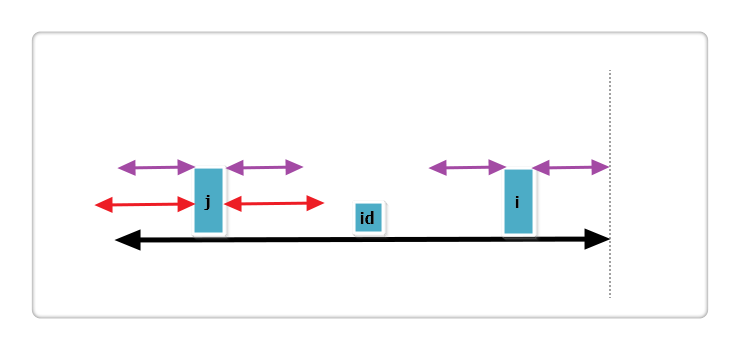
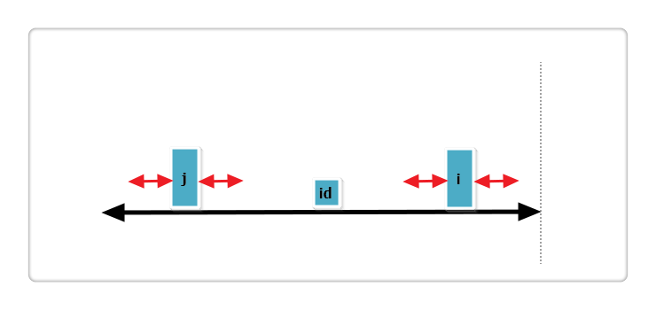
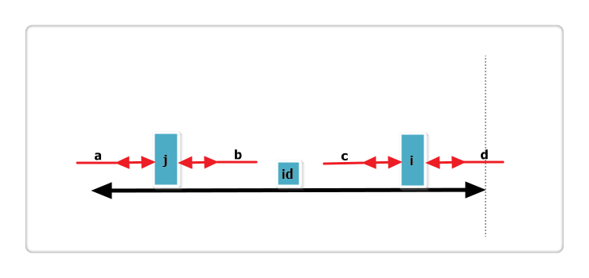
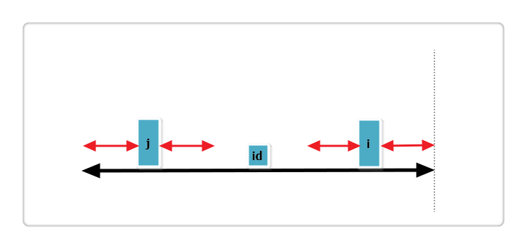

# 马拉松
## 简介
马拉松算法用来求解最长回文串。

## 算法分析
根据回文的性质，p[i]的值基于以下三种情况得出：
### （1）j 的回文串有一部分在 id 的之外

上图中，黑线为 id 的回文，i 与 j 关于 id 对称，红线为 j 的回文。那么根据代码此时p[i] = mx - i，即紫线。那么p[i]还可以更大么？答案是不可能！见下图：

假设右侧新增的紫色部分是p[i]可以增加的部分，那么根据回文的性质，a 等于 d ，也就是说 id 的回文不仅仅是黑线，而是黑线+两条紫线，矛盾，所以假设不成立，故p[i] = mx - i，不可以再增加一分。

### （2）j 回文串全部在 id 的内部

根据代码，此时p[i] = p[j]，那么p[i]还可以更大么？答案亦是不可能！见下图：

假设右侧新增的红色部分是p[i]可以增加的部分，那么根据回文的性质，a 等于 b ，也就是说 j 的回文应该再加上 a 和 b ，矛盾，所以假设不成立，故p[i] = p[j]，也不可以再增加一分。

### （3）j 回文串左端正好与 id 的回文串左端重合

根据代码，此时p[i] = p[j]或p[i] = mx - i，并且p[i]还可以继续增加，所以需要
```
while (s_new[i - p[i]] == s_new[i + p[i]]) 
    p[i]++;
```
[算法分析](https://segmentfault.com/a/1190000008484167)

## 代码
```
#include <iostream>  
#include <cstring>
#include <algorithm>  

using namespace std;

char s[1000];
char s_new[2000];
int p[2000];

int Init()
{
    int len = strlen(s);
    s_new[0] = '$';
    s_new[1] = '#';
    int j = 2;

    for (int i = 0; i < len; i++)
    {
        s_new[j++] = s[i];
        s_new[j++] = '#';
    }

    s_new[j] = '\0';  // 别忘了哦
    
    return j;  // 返回 s_new 的长度
}

int Manacher()
{
    int len = Init();  // 取得新字符串长度并完成向 s_new 的转换
    int max_len = -1;  // 最长回文长度

    int id;
    int mx = 0;

    for (int i = 1; i < len; i++)
    {
        if (i < mx)
            p[i] = min(p[2 * id - i], mx - i);  // 需搞清楚上面那张图含义, mx 和 2*id-i 的含义
        else
            p[i] = 1;

        while (s_new[i - p[i]] == s_new[i + p[i]])  // 不需边界判断，因为左有'$',右有'\0'
            p[i]++;

        // 我们每走一步 i，都要和 mx 比较，我们希望 mx 尽可能的远，这样才能更有机会执行 if (i < mx)这句代码，从而提高效率
        if (mx < i + p[i])
        {
            id = i;
            mx = i + p[i];
        }

        max_len = max(max_len, p[i] - 1);
    }

    return max_len;
}

int main()
{
    while (printf("请输入字符串：\n"))
    {
        scanf("%s", s);
        printf("最长回文长度为 %d\n\n", Manacher());
    }
    return 0;
}
```

## 实例
[LeetCode最长回文](https://leetcode.com/problems/longest-palindromic-substring/)